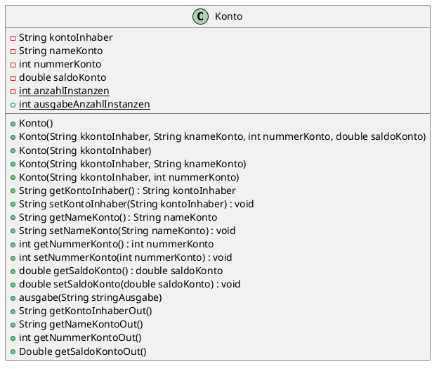

# Tag2

## Konto 01

## Schritt 1
* private verbietet jeglichen Zugriff von ausserhalb der Klasse
* public erlaubt jeglichen Zugriff von überall

## Schritt 2
* Der Konstruktor bestimmt was festgelegt werden muss beim erstellen einer neuen Instanz dieses Objekts
* überladen heist dass man mehrere Konstruktor oder Methoden mit dem gleichen Namen erstellen kann wenn die Eingabeparameter bei jeder Methode oder Konstruktor anderst ist
* Der Konstruktor wird vom Compiler automatisch erstellt

## Schritt 3
* Eine Instanz erstellen bedeuted ein neues Objekt einer Klasse zu erstellen
* instanzTestKonto1 ist eine Variable
* Der Speicherweg von instanzTestKonto1 führt nun zum gleichen Speicherobjekt wie der von instanzTestKonto

## Schritt 4
* Es gehen alle ausser kontoInhaber da dieser private ist und wir uns ausserhalb der Klasse befinden

## Schritt 5
* Alle wurden auf Privat gesetzt und sind jetzt nur noch über kreeirte instanzen von Konto erreichbar

## Schritt 6
* Scanner erstellt zur eingabe und alle Daten eingelesen und ausgegeben

## Schritt 7 UML

