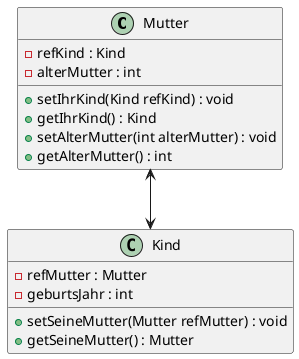
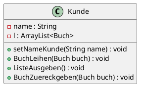

# Muki-Beispiel

## Frage 1

## Frage 2

* Nein ein Kind kann nicht zwei Mütter haben weil wenn man dem Kind eine zweite Mutter hinzufügen will dann wird die erste Mutter einfach überschrieben.

## Frage 3

* Ja man kein beiden Müttern das gleiche Kind geben aber das Kind ist dann nur mit einer dieser Mütter zurückverbunden.

# Bücherei-Beispiel

## Auftrag 1

* Sie sollten auf dem Kunden aufgerufen werden da Er sie ausleiht und es in seiner Bücherliste gespeichert werden soll.
* Mit einer "if(!getStatus(buch))" Abfrage.

## Auftrag 2

* Ja habe ich (:

## Auftrag 3

* Ja weil es wird einfach der Status des Buches auf true also ausgeliehen gesetzt.

## Auftrag 4

* Die Arrays sind vom Typ Buch und vom Typ Kunde.
* Man sollte nicht mit Strings arbeiten da das keine Elente sind mit denen man überhaupt irgendwas anfangen könnte.