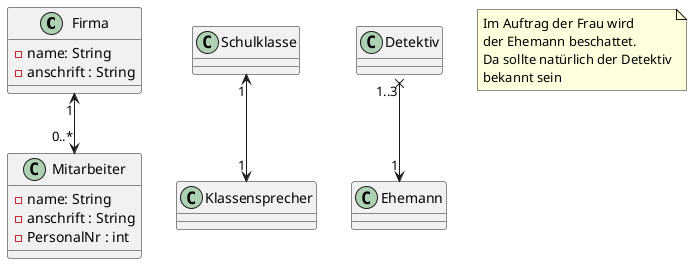
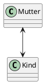

# Assoziaziation : Beziehung zwischen Klasse

## Begriff : "Assoziation"

* Die Assoziation ist eine Beziehung zwischen zwei Klassen. Diese   Klassen sind über gewisse Möglichkeiten miteinander verbunden. So kennen sich die Klassen je nach Möglichkeit gegenseitig, einseitig usw.

* Sind Beziehungen zwischen Klassen sehr lose, aber doch nicht ganz unabhängig, spricht man generell von Assoziation.

## Defintion Assoziation

* Assoziation bedeutet allgemein: "NUTZT EIN".
* Ein Kunde NUTZT EIN Konto.

## Verschiedene Asoziationen

* Beide Klassen kennen sich, wobei es auch Fälle gibt, wo die eine Klasse die andere nicht kennen darf (Gerichtete Assoziation).

* Unten sind verschiedene Assoziationen in UML-Notation1 zu sehen. Die Notation ist eigentlich selbsterklärend. Wird nichts angegeben geht man davon aus, dass sich beide Klassen kennen.

## Navigierbereich

* Die Richtung wie sich die Klassen sehen, kann sich ändern. Ein Star kennt vermutlich seinen Fan nicht (unidirektionale Beziehung), umgekehrt sicherlich.

* Trifft der Star einen entsprechenden Fan, wird es eine bidirektionale Beziehung. Die Kenntnis der Klassen hat sich geändert (navigiert).

* Siehe oben: Der Ehemann kommt dem Detektiv auf die Schliche!

## Bidirektionale Umsetzung mit Java

* Wie beim Muki-Beispiel

