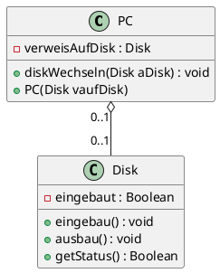

# Praxis-Beispiel Aggregation : Computerbauteile

```plantuml
@startuml
class PC{
    -verweisAufDisk : Disk
    +diskWechseln(Disk aDisk) : void
    +PC(Disk vaufDisk)
}
class Disk{
    -eingebaut : Boolean
    +eingebau() : void
    +ausbau() : void
    +getStatus() : Boolean
}
PC "0..1" o-- "0..1" Disk
@enduml
```

## Programmierbeispiel unter M226Programming