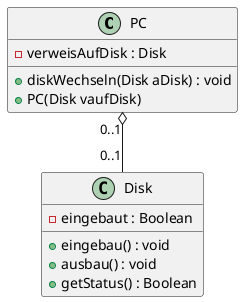
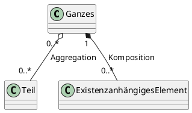
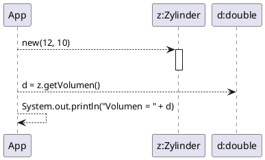

# Tag7

## Praxis-Beispiel Aggregation : Computerbauteile

* Programmierbeispiel unter M226Programming

## Komposition (Ist-Teil-Assoziation)

* Eine Komposition ist eine strenge Form der Aggregation, bei der die Teile von der Ganzen-Existenz abhängig sind.

## Beispiel:

* Das Museum hat verschiedene Räume. Die Räume können ohne Museumsgebäude nicht existieren. Die Räume sind existentiell abhängig vom Gebäude. Die Lebenszeit der Einzelteile ist der des Ganzen untergeordnet. Sie werden also zusammen mit dem Ganzen oder später erzeugt, und sie werden vorher oder zusammen mit dem Ganzen zerstört.

## Definition Komposition

* Bei der Komposition spricht man von „IST TEIL VON“
* Der Raum IST TEIL VOM Museum!

## Unterschiede: Aggregation vs. Komposition

* Die Kardinalität auf der "Ganz-Seite" kann nur 1 sein
* Jedes Teil ist von nur genau einem Kompositionsobjekt abhängig

## UML-Notation

* Die Komposition wird als Linie zwischen zwei Klassen gezeichnet. Die Linie wird auf der Seite des Ganzen mit einer ausgefüllten Raute versehen.

## Zusammenfassung

* Eigentlich unterscheiden sich Aggregation und Komposition gar nicht so stark voneinander. Beide haben ArrayList und ähnliche Vorgaben bei den Referenzen.

* Der wesentliche Unterschied ist, dass die Instanz einer "Teil-Seite" abhängig ist von Lebenszyklus der "Ganz-Seite". Es werden "Teil-Seiten" innerhalb von Code von "Ganz-Seiten" instanziert.

## Praxisauftrag Sequenzdiagramme

