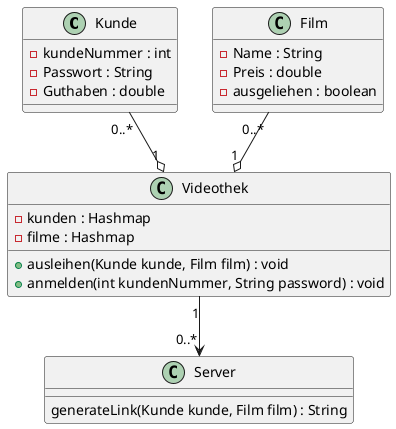
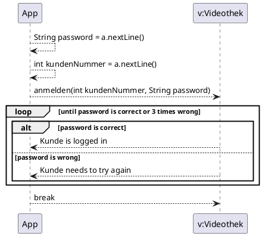
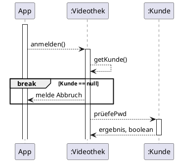

# Tag8

## Klassendiagramm zu Videothek

```plantuml
@startuml
class Kunde{
-kundeNummer : int
-Passwort : String
-Guthaben : double
}
class Film{
-Name : String
-Preis : double
-ausgeliehen : boolean
}
class Videothek{
-kunden : Hashmap
-filme : Hashmap
+ausleihen(Kunde kunde, Film film) : void
+anmelden(int kundenNummer, String password) : void
}
class Server{
generateLink(Kunde kunde, Film film) : String
}

Kunde "0..*" --o "1" Videothek
Film "0..*" --o "1" Videothek
Videothek "1" --> "0..*" Server  
@enduml
```

## Sequenzdiagramm zu Videothek

```plantuml
@startuml
participant "App"
participant "v:Videothek"
"App" --> "App" : String password = a.nextLine()
"App" --> "App" : int kundenNummer = a.nextLine()

"App" --> "v:Videothek" : anmelden(int kundenNummer, String password)
loop until password is correct or 3 times wrong
alt password is correct
    "v:Videothek" --> "App" : Kunde is logged in
else password is wrong
"v:Videothek" --> "App" : Kunde needs to try again
end
end
"App" --> "v:Videothek" : break
@enduml
```

```plantuml
@startuml

participant "App"
participant ":Videothek"
participant ":Kunde"

activate "App"
loop 1-3 /während nicht angemeldet
"App" --> ":Videothek" : anmelden()
activate ":Videothek"
":Videothek" --> ":Videothek" : getKunde()
break Kunde == null
":Videothek" --> "App" : melde Abbruch
end
":Videothek" --> ":Kunde" : prüefePwd
activate ":Kunde"
":Kunde" --> ":Videothek" : ergebnis, boolean
deactivate ":Kunde"
@enduml
```